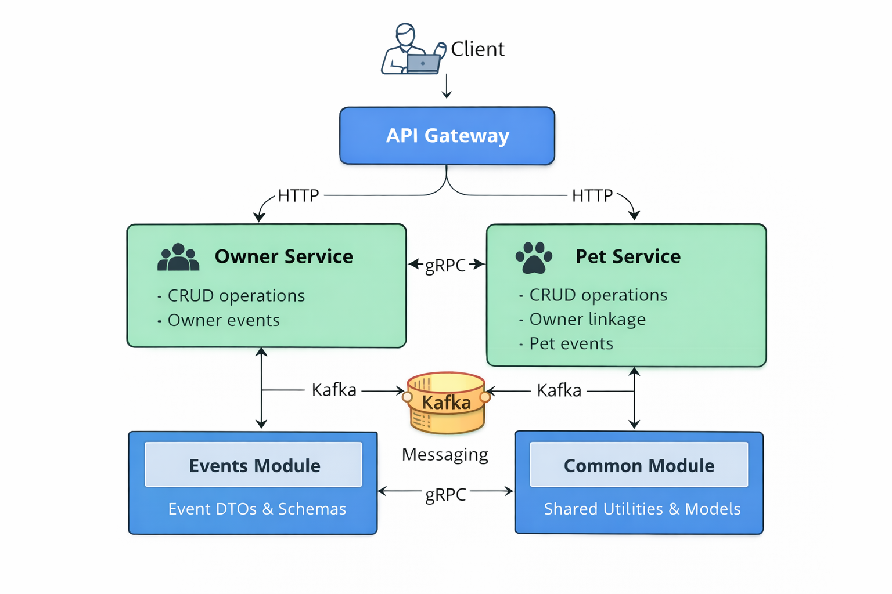

# Pet Owner Platform

## Overview

**Pet Owner Platform** — это микросервисная система для управления владельцами питомцев, их питомцами и связанными событиями.

Проект реализован как **multi-module Maven приложение** на базе **Spring Boot / Spring Cloud** и демонстрирует:

* распределённую архитектуру
* взаимодействие сервисов
* event-driven подход с использованием Kafka

---

## Архитектура системы

Система состоит из нескольких независимых сервисов:



---

## Модули проекта

### gateway-service

API Gateway — единая точка входа в систему.

Функции:

* маршрутизация запросов
* проксирование к сервисам
* упрощение взаимодействия клиентов с системой

---

### owner-service

Сервис управления владельцами питомцев.

Функции:

* CRUD операции для владельцев
* публикация событий в Kafka

---

### pet-service

Сервис управления питомцами.

Функции:

* CRUD операции для питомцев
* связь с владельцами
* публикация и обработка событий

---

### events

Модуль с описанием событий системы.

Содержит:

* DTO событий
* схемы сообщений для Kafka
* общие контракты между сервисами

---

### common

Общий модуль с переиспользуемыми компонентами.

Содержит:

* общие модели
* утилиты
* базовые классы

---

## Взаимодействие сервисов

### Синхронное взаимодействие

Через **Gateway Service**:

```
Client → Gateway → Owner / Pet Service
```

---

### Асинхронное взаимодействие (Kafka)

Сервисы обмениваются событиями:

* owner-service публикует события
* pet-service подписывается (и наоборот)

Пример:

```
Owner создан → событие → Kafka → Pet Service реагирует
```

---

## Пример сценария

```
1. Клиент отправляет запрос на создание владельца
2. Gateway перенаправляет запрос в owner-service
3. owner-service сохраняет данные
4. публикует событие в Kafka
5. pet-service получает событие и обновляет данные (если нужно)
```

---

## Конфигурация

Настройки задаются через `application.yml` каждого сервиса.

Пример Kafka:

```yaml
spring:
  kafka:
    bootstrap-servers: localhost:9092
```

---

## Технологии

* Java 21
* Spring Boot
* Spring Cloud
* Spring Kafka
* Apache Kafka
* Maven (multi-module)
* Docker

---

## Использование в командной разработке

Проект разделён на независимые модули, что позволяет:

* разрабатывать сервисы параллельно
* масштабировать систему
* изолировать ответственность

---

## Возможные улучшения

* добавление service discovery
* централизованная конфигурация
* трассировка (Zipkin / OpenTelemetry)
* retry / DLQ для Kafka

---

